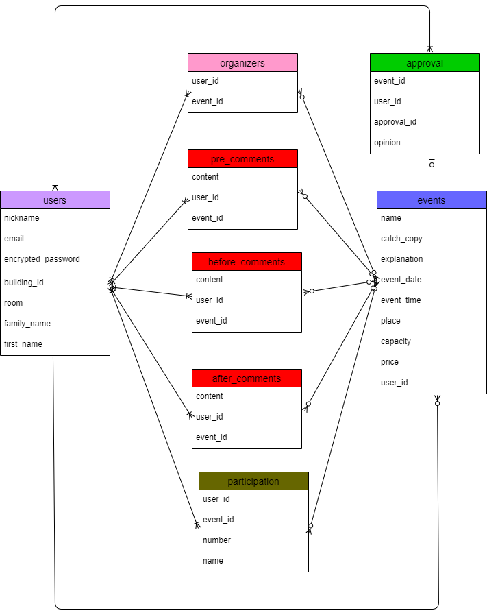
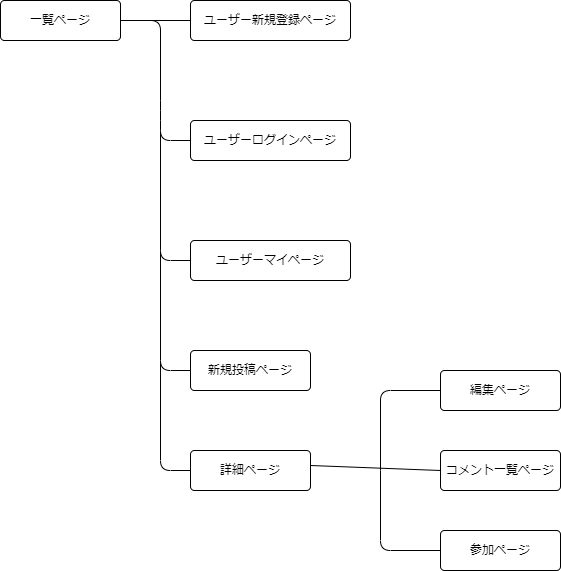

# アプリケーション名
クレプラ自治会

# アプリケーション概要
自治会で行うイベントを企画立案から実行、保存までできる

# URL
http://35.75.98.80

# テスト用アカウント
・Basic認証ID:admin
・Basic認証パスワード:2222

・メールアドレス(管理者)：crest@example
・パスワード           ：crest1234

・メールアドレス(提案者)：itirou@1111
・パスワード           ：itirou1111

・メールアドレス(一般)：jirou@2222
・パスワード         ：jirou2222

# 利用方法
## イベント開催
1.トップページのヘッダーからユーザー新規登録を行う
2.イベント提案ボタンから、イベント内容（イベント名、キャッチコピー、内容詳細）を
入力して投稿する
3.投稿内容を自治会役員と提案者で審議する（コメント機能を利用する）
4.開催が決定すると全てのユーザーが見れるようになる
5.開催決定したイベントについては、ログインユーザーのみ参加申し込みができる

# アプリケーションを作成した背景
新たに自治会が発足し、住民同士の交流を目的としたイベント開催を行うことになった。
しかしながら開催まで至ったイベントが少なく、目的としていた交流が進んでいない状態が続いていた。
そこで自治会役員と住民が同じアプリ上で繋がり、イベント案の提出から実施まで一気通貫で
進めていけるアプリケーションを開発することにした。

# 洗い出した要件
https://docs.google.com/spreadsheets/d/1ClsACndiVJNfqMjd0ZKhxHyk3vTEo3YrlZtCrsG1FkQ/edit#gid=982722306

# 実装予定の機能
メール通知機能、スケジュール機能

# データベース設計

# 画面遷移図

# 開発環境
・フロントエンド
・バックエンド
・インフラ
・テスト
・テキストエディタ
・タスク管理

# ローカルでの動作方法
git clone https://github.com/nickAJ286/crestprimejitikai.git
cd crestprimejitikai
rm -rf .git
bundle install
yarn install
rails db:create

# 工夫したポイント
ログインユーザーによって6つの属性があり、イベントの状況によって3つの区分けがあるので
表示の有無や表示の位置、編集できる範囲を分けることに苦労した。
今後コメント昨日と画像投稿機能を実装し、アプリ内で審議やミーティングを行い、
イベント開催後には画像投稿で思い出と反省点を残せるようにしたいと考えている。
