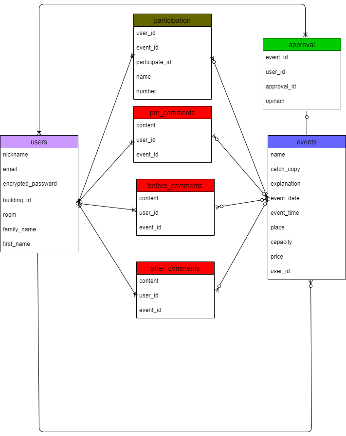

# アプリケーション名
クレプラ自治会

# アプリケーション概要
自治会で行うイベントを企画立案から実行、保存までできる

# URL

# テスト用アカウント

# 利用方法
## イベント開催
1.トップページのヘッダーからユーザー新規登録を行う
2.イベント提案ボタンから、イベント内容（イベント名、キャッチコピー、内容詳細）を入力して投稿する
3.投稿内容を自治会役員と提案者で審議する（コメント機能を利用する）
4.開催が決定すると全てのユーザーが見れるようになる
5.開催決定したイベントについては、ログインユーザーのみ参加申し込みができる

# アプリケーションを作成した背景
新たに自治会が発足し、住民同士の交流を目的としたイベント開催を行うことになった。
しかしながら開催まで至ったイベントが少なく、目的としていた交流が進んでいない状態が続いていた。
そこで自治会役員と住民が同じアプリ上で繋がり、イベント案の提出から実施まで一気通貫で進めていけるアプリケーションを
開発することにした。

# 洗い出した要件
https://docs.google.com/spreadsheets/d/1ClsACndiVJNfqMjd0ZKhxHyk3vTEo3YrlZtCrsG1FkQ/edit#gid=982722306

# 実装予定の機能
メール通知機能、スケジュール機能

# データベース設計

# 画面遷移図

# 開発環境
・フロントエンド
・バックエンド
・インフラ
・テスト
・テキストエディタ
・タスク管理

# ローカルでの動作方法

# 工夫したポイント

